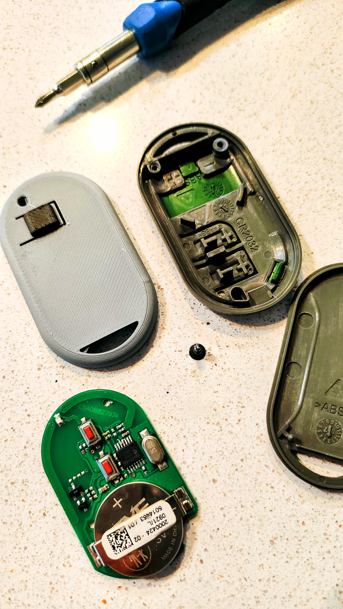
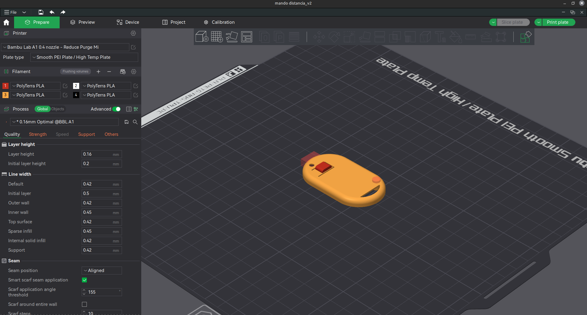
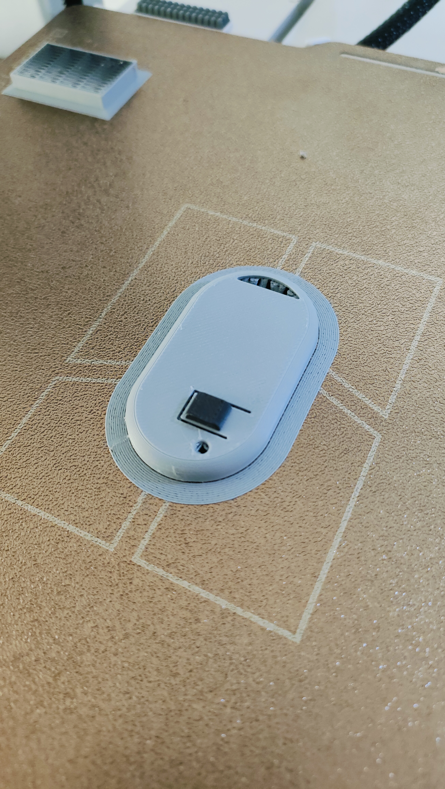
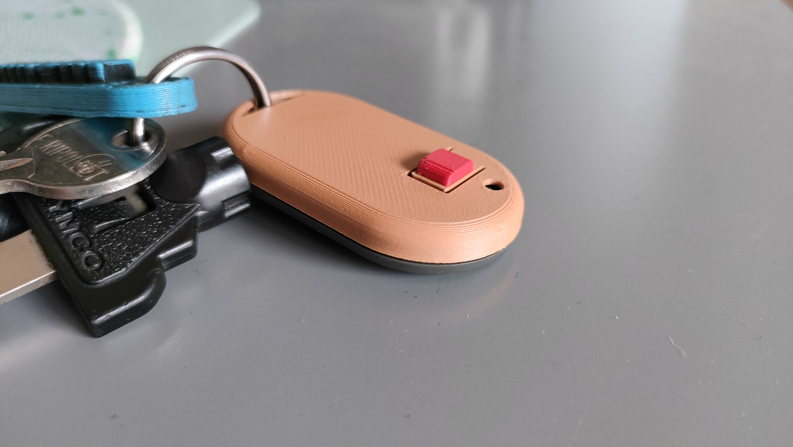
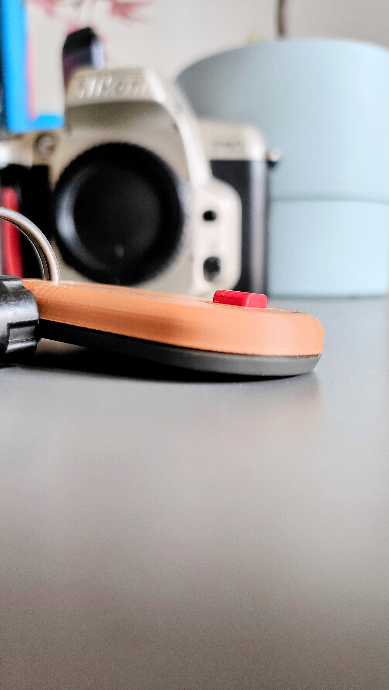
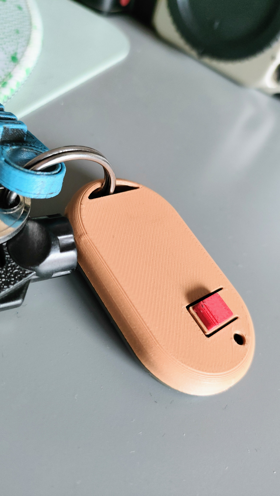
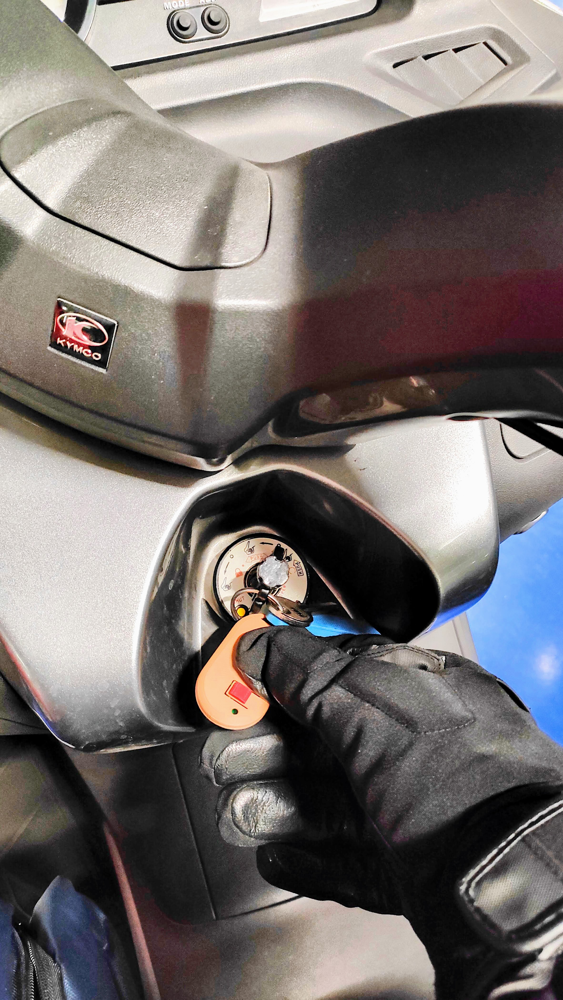

# TP2Mini FORSA
Adaptación de un mando a distancia parking tipo TP2Mini FORSA con una adaptación del botón de apertura

Este proyecto nace cómo necesida de un motero que lleva guantes y el mando del parking tiene unos botones un poco difíciles de accionar con los guantes (sobre todo de invierno) puestos. También es un proyecto para ayudar **a persona con movilidad reducida** o dificultades para poder utilizar el mando tal cual lo diseña el fabricante

Rediseño de la pieza superior donde van los botones. La electrónica y tapa posterior se mantiene la original.

## Diseño FreeCAD
El diseño está realizado en FreeCAD. Tenéis el fuente incluido en el repositorio.

## Impresión 3D
Uno de los principales problemas que encontraréis será con la impresión 3D de esta pieza: mucho material de soporte.

## Resultado final
El resultado muy final: una carcasa nueva mucho mas operativa y fácil de utilizar con guantes.

